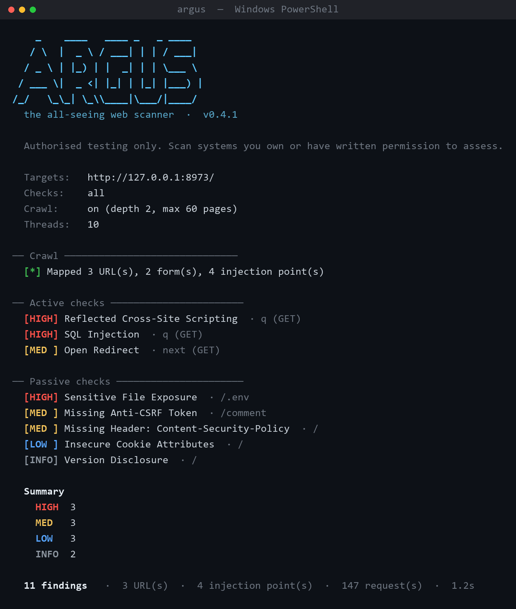

# ARGUS

**A lightweight web application vulnerability scanner for authorised testing.**


Argus crawls a web application, finds every place it accepts input query
parameters and form fields and probes each one for the bugs that show up on
almost every first-pass assessment: SQL injection, cross-site scripting, path
traversal, OS command injection, open redirects, missing CSRF tokens, weak
security headers and files that shouldn't be reachable from the web root.

It's named after **Argus Panoptes**, the hundred-eyed giant of Greek myth who
never slept. The whole point of a scanner is to watch every input at once.

> I started this as a class exercise that just checked "does this page have an
> input box?" and called everything vulnerable. That bothered me — it doesn't
> *test* anything. So I rebuilt it into something that sends real payloads and
> reasons about the responses. This is that rewrite.

---

## ⚠️ Authorised use only

This is a security testing tool. **Only scan systems you own or have explicit,
written permission to test.** Unauthorised scanning of computer systems is
illegal in most jurisdictions (e.g. the Computer Fraud and Abuse Act in the US,
the Computer Misuse Act in the UK). You are solely responsible for how you use
it.

To make it easy to try safely, the repo ships a deliberately vulnerable demo app
(`examples/vulnerable_app.py`) that binds to `127.0.0.1`. Point Argus at that.

---

## Features

- **Eight detection modules**, each using a real technique rather than a guess
  (see the table below).
- **Same-origin crawler** that discovers linked pages and forms, bounded by
  depth and page count.
- **Concurrent** by default (thread pool) with a **global, thread-safe rate
  limiter** — turning up `--threads` never turns the scan into a stress test.
- **Live, colourised terminal output** with a severity summary; colour switches
  itself off when piped to a file or when `NO_COLOR` is set.
- **JSON and HTML reports** for sharing or diffing between runs.
- **CI-friendly exit code** — non-zero when findings exist, so it drops into a
  pipeline gate.
- **One runtime dependency** (`requests`). HTML is parsed with the standard
  library, so there's almost nothing to install.

### What it checks

| ID         | Vulnerability             | How Argus detects it                                                             | CWE     |
|------------|---------------------------|----------------------------------------------------------------------------------|---------|
| `sqli`     | SQL Injection             | DB error fingerprints, and a boolean-differential test (`1=1` vs `1=2`)          | CWE-89  |
| `xss`      | Reflected XSS             | Injects a tagged payload; flags it only if the metacharacters reflect un-encoded | CWE-79  |
| `lfi`      | Path Traversal / LFI      | Requests `/etc/passwd` & `win.ini` via `../`; matches their contents             | CWE-22  |
| `cmdi`     | OS Command Injection      | Time-based blind: injects `sleep N`, confirms the delay scales with the payload  | CWE-78  |
| `redirect` | Open Redirect             | Feeds a canary host into the parameter; inspects the `Location` header           | CWE-601 |
| `csrf`     | Missing Anti-CSRF Token   | Flags state-changing (`POST`) forms with no unpredictable token field            | CWE-352 |
| `exposure` | Sensitive File Exposure   | Probes for `.git/`, `.env`, backups; uses a soft-404 baseline to cut noise       | CWE-538 |
| `headers`  | Headers / Info Disclosure | Audits CSP/HSTS/etc., cookie flags, and version banners                          | CWE-693 |

---

## Install

```bash
git clone https://github.com/tejasva/argus.git
cd argus
pip install -e .            
```

Or just install the one dependency and run it in place — no packaging required:

```bash
pip install requests       
python -m argus --help
```

Requires **Python 3.9+**.

---

## Quick start

Try it against the bundled demo app (two terminals):

```bash
# terminal 1 — start the intentionally vulnerable target
python examples/vulnerable_app.py 8973

# terminal 2 — crawl and scan it
python -m argus http://127.0.0.1:8973/ --crawl
```

Other common invocations:

```bash
# a single URL with parameters, only two checks
argus "http://127.0.0.1:8973/search?q=test" --checks sqli,xss

# see the command-injection check fire (this endpoint isn't linked, so scan it directly)
argus "http://127.0.0.1:8973/ping?host=localhost" --checks cmdi

# authenticated scan behind a session cookie, through Burp
argus http://target.tld/ --crawl -b "session=..." --proxy http://127.0.0.1:8080

# write reports and be polite about it
argus http://target.tld/ --crawl --delay 0.3 --json report.json --html report.html
```

---

## Example output



<details>
<summary><b>Show the same run as plain text</b></summary>

```
    _    ____   ____ _   _ ____
   / \  |  _ \ / ___| | | / ___|
  / _ \ | |_) | |  _| | | \___ \
 / ___ \|  _ <| |_| | |_| |___) |
/_/   \_\_| \_\\____|\___/|____/
  the all-seeing web scanner  ·  v0.4.1

  Authorised testing only. Scan systems you own or have written permission to assess.

  Targets:               http://127.0.0.1:8973/
  Checks:                all
  Crawl:                 on (depth 2, max 60 pages)
  Threads:               10

── Crawl ───────────────────────────────────
  [*] Mapped 3 URL(s), 2 form(s), 4 injection point(s)

── Active checks ───────────────────────────
  [HIGH] Reflected Cross-Site Scripting  · q (GET)
  [HIGH] SQL Injection  · q (GET)
  [MED ] Open Redirect  · next (GET)

── Results ─────────────────────────────────

  [HIGH] SQL Injection  CWE-89
      URL:               http://127.0.0.1:8973/search
      Parameter:         q  (GET)
      Payload:           '
      Evidence:          MySQL error surfaced: 'SQL syntax; check the manual ...'
      Confidence:        Firm
      Fix:               Use parameterised queries / prepared statements. Bind all
                         user input; never build SQL by string concatenation.

  ... (findings elided) ...

  Summary
    HIGH     3
    MED      3
    LOW      3
    INFO     2

  11 findings
  3 URL(s) · 4 injection point(s) · 147 request(s) · 1.1s
```

</details>

(Colour is auto-disabled when the output isn't a terminal — piped to a file, or
`NO_COLOR` set.)

---

## How it works

The design keeps three concerns strictly separate, which is what makes each part
testable on its own:

```
        discovery              decision                presentation
   ┌────────────────┐    ┌────────────────────┐    ┌──────────────────┐
   │ crawler.py     │ →  │ checks/*.py        │ →  │ reporter.py      │
   │ (links, forms) │    │ (one class each)   │    │ (terminal/JSON/  │
   └────────────────┘    └────────────────────┘    │  HTML)           │
          │                       ▲                └──────────────────┘
          ▼                       │
   ┌────────────────┐    ┌────────────────────┐
   │ scanner.py     │ →  │ http_client.py     │
   │ (fan-out pool) │    │ (throttle, retries)│
   └────────────────┘    └────────────────────┘
```

A few decisions worth calling out:

- **Injection points, not URLs.** The engine flattens query parameters and form
  fields into a single `InjectionPoint` abstraction, so a check never has to
  care whether the parameter came from a URL or a `<form>`. It just asks for a
  request with one value swapped out.
- **Differential SQLi.** Beyond error strings, the boolean test sends an
  always-true and an always-false clause and compares each response to the
  baseline with a similarity ratio. "True looks like the original, false
  doesn't" is a much stronger signal than string matching, and it survives pages
  full of timestamps and CSRF tokens.
- **Time-based command injection.** Reflection can be swallowed; a delay can't.
  Argus injects `sleep 5`, and only reports if a second `sleep 9` probe delays
  proportionally — ruling out a coincidentally slow endpoint. The sleep only
  runs when the target is actually vulnerable, so clean parameters stay fast.
- **Soft-404 baselines.** Before probing for sensitive files, Argus fetches a
  path it knows doesn't exist. Sites that answer `200 OK` for everything would
  otherwise produce a wall of false positives; anything resembling that baseline
  is discarded.
- **One rate limiter for all threads.** The delay is enforced globally at the
  HTTP layer, so concurrency speeds up the scan without changing how hard the
  target gets hit.

---

## Project layout

```
argus/
  cli.py              argparse front-end, exit codes
  scanner.py          engine: discovery, fan-out, aggregation
  crawler.py          same-origin crawler + stdlib HTML parsing
  http_client.py      throttled, retrying, thread-safe requests wrapper
  models.py           Finding / Form / InjectionPoint / ScanResult
  payloads.py         payloads + detection signatures (data, no logic)
  reporter.py         terminal UI + JSON/HTML export
  checks/
    base.py           InjectionCheck / TargetCheck abstractions
    sql_injection.py  xss.py  path_traversal.py  command_injection.py
    open_redirect.py  csrf.py  security_headers.py  sensitive_files.py
examples/
  vulnerable_app.py   deliberately-insecure demo target (localhost only)
tests/                offline unit tests (no network)
```

Adding a new check is a two-line change to `checks/__init__.py`: import the
class, add it to the registry. The CLI's `--checks` list, the engine, and the
help text all read from that one source of truth.

---

## Testing

```bash
pip install pytest
pytest
```

The suite is fully offline — signatures are matched directly, and the injection
checks are driven against a fake HTTP client, so verdicts are deterministic and
no demo server is required.

---

## Reports

- `--json report.json` — structured findings plus scan metadata (targets,
  timing, request count, severity histogram). Good for diffing runs or feeding
  another tool.
- `--html report.html` — a self-contained, styled report suitable for handing to
  someone who doesn't live in a terminal.

---

## Limitations

I'd rather be upfront than oversell this:

- It finds **reflected** and **error/blind** classes well; it does **not** do
  stored XSS, second-order injection, or anything requiring multi-step business
  logic.
- No JavaScript engine — links and forms rendered entirely client-side (heavy
  SPAs) won't be discovered by the crawler.
- Authentication is cookie/header based only; there's no login-form automation.
- Like any scanner, it produces false positives and false negatives. Treat
  findings as leads to verify by hand, not as proof. The CSRF check in
  particular is a heuristic and is reported as *tentative*.

---

## Roadmap

- [ ] `robots.txt` awareness and an opt-in politeness profile
- [ ] Stored-XSS detection (submit, then re-crawl for the marker)
- [ ] Pluggable auth (login-form replay)
- [ ] SARIF export for GitHub code scanning
- [ ] A small signature-tuning harness to measure false-positive rate

---
